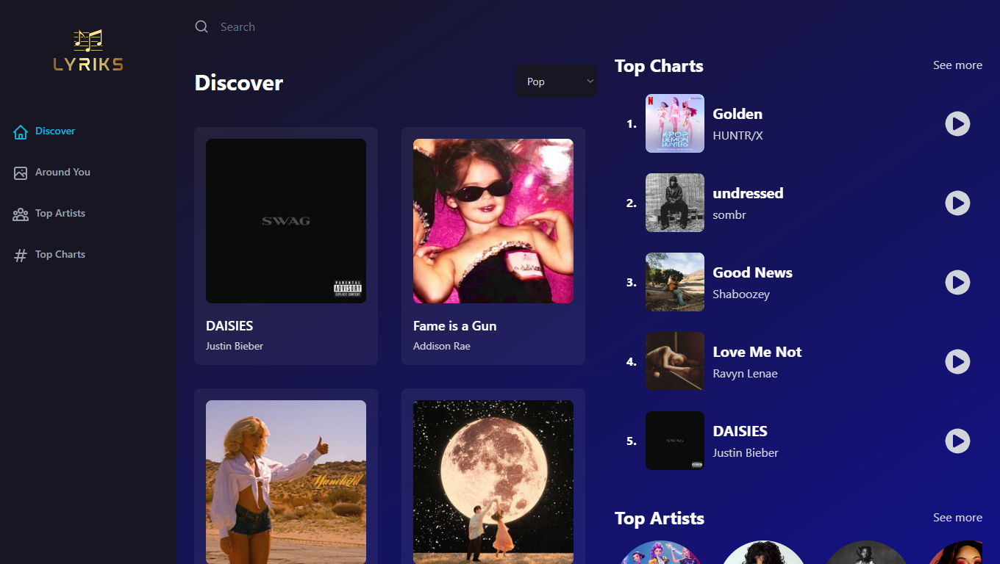
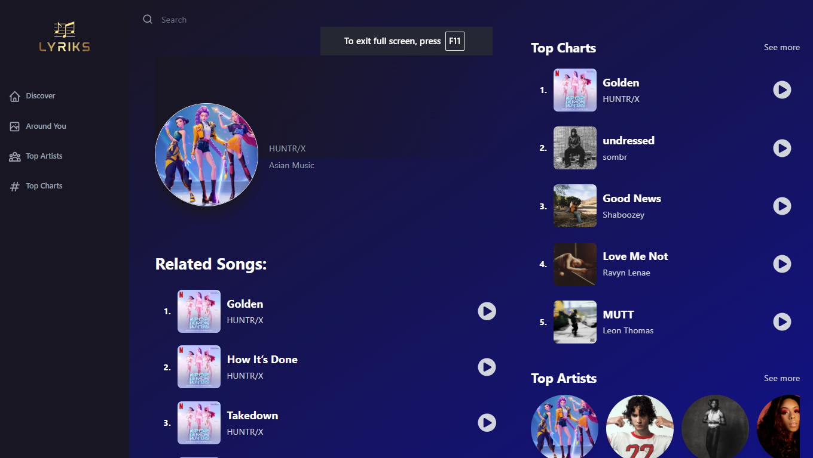
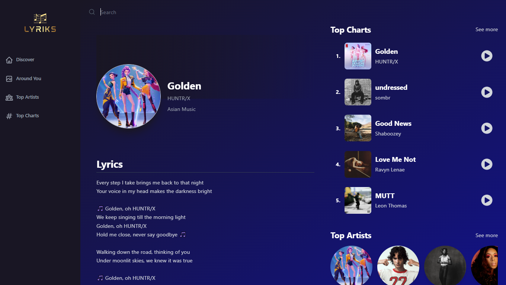

# 🎵 Lyriks

Lyriks is a **music streaming and lyrics web application** built with **React, Vite, and Tailwind CSS**.  
It allows users to explore music, view top charts, search for songs, and display lyrics in a clean, responsive UI.

---

## 🚀 Features

- 🎶 Browse trending songs and top charts
- 🔍 Search for artists, tracks, and genres
- 📌 View detailed artist and song information
- 📝 Fetch and display lyrics in real time
- 🎨 Modern responsive UI with Tailwind CSS
- ⚡️ Fast development with Vite
- ✅ Clean commits with Husky + lint-staged
- ✨ Consistent code formatting using ESLint + Prettier

---

## 🛠️ Tech Stack

- [React](https://react.dev/) – UI library
- [Vite](https://vitejs.dev/) – Fast build tool
- [Tailwind CSS](https://tailwindcss.com/) – Styling
- [ESLint](https://eslint.org/) & [Prettier](https://prettier.io/) – Code quality
- [Husky](https://typicode.github.io/husky/) & [lint-staged](https://github.com/okonet/lint-staged) – Git hooks & staged file linting
- External Music API (proxied with CORS Anywhere)

---

## ⚙️ Installation & Setup

1. **Clone the repository**

[](https://github.com/rimarayya/react-spotify-clone)
[](https://gitlab.com/uni.rima.rayya/react-spotify-clone)


2. **Move to the project directory**

   ```bash
   cd react-spotify-clone
   ```

3. **Install dependencies**

   ```bash
   npm install
   ```

4. **Enable Husky (required after install)**

   ```bash
   npm run prepare
   ```

   > This sets up Git hooks for pre-commit checks.

5. **Fix CORS restriction (required step)**  
   Go to 👉 [CORS Anywhere Demo](https://cors-anywhere.herokuapp.com/corsdemo)  
   Click **"Request temporary access to the demo server"**.  
   This enables the app to fetch data correctly.

6. **Run the development server**

   ```bash
   npm run dev
   ```

7. **Build for production**

   ```bash
   npm run build
   ```

---

## 📦 Project Structure

```
lyriks/
│── index.html
│── package.json
│── vite.config.js
│── tailwind.config.js
│── .eslintrc.js
│── .prettierrc
│── .eslintignore
│── .prettierignore
│── src/         # React components and pages
│── public/      # Static assets
│── .husky/      # Git hooks
```

---

## 🖼️ Screenshots

| Discover Page                          | Artist Details                        | Lyrics View                           |
| -------------------------------------- | ------------------------------------- | ------------------------------------- |
|  |  |  |

---

## ⚠️ Deployment Note

This project **cannot be deployed directly** due to CORS limitations.  
Users must manually request access through the [CORS Anywhere Demo](https://cors-anywhere.herokuapp.com/corsdemo) before using the app.

---

## 🤝 Contributing

Contributions are welcome!

- Fork the repo
- Create a feature branch
- Run `npm run lint` and `npm run format` before committing
- Submit a pull request 🚀
